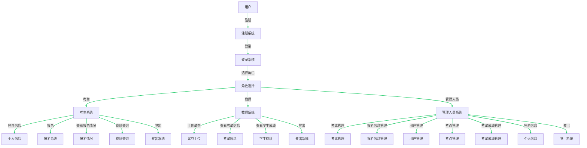

# 需求分析与系统设计

## 需求分析

### 任务概述

#### 任务目标

  六级报名系统是一个基于在线平台的综合性应用系统，旨在为考生、教师和考试管理人员提供便捷的六级考试报名和管理服务。系统通过整合各项功能，实现了从考生信息注册、试题录入、报名和缴费，到线上考场答题、自动阅卷和教师阅卷，再到考试结果查询等全流程的自动化和数字化管理。系统的主要目标是提供一个高效、可靠且用户友好的平台，以简化六级考试相关流程，减少纸质工作和人工操作的繁琐性，并提升系统的安全性和数据的准确性。通过该系统，考生可以方便地完成报名和缴费，灵活选择考试时间和考点，参与线上答题并及时查询考试结果。教师可以管理试题、进行阅卷和评分，确保评分的客观性和准确性。考试管理人员可以对考试信息进行综合管理，并生成成绩报告。除此之外，系统将注重安全性和保密性，采用适当的身份验证和权限管理机制，确保用户的个人信息和考试数据不受未授权访问和篡改。

  总的来说，六级报名系统旨在建立一个高效、可靠、安全和用户友好的在线平台，为考生、教师和考试管理人员提供全面的六级考试报名和管理服务，实现报名流程的数字化、自动化和信息化，从而提升六级考试的效率和质量。更细化地看，我们可以从如下几个方面进行解析：

1. 实现用户信息管理功能：
   - 允许考生、教师和考试管理人员注册账号，并提供相应的登录功能。
   - 考生可以填写个人信息并随时修改，包括姓名、身份证号、联系方式等。同时系统还支持上传的身份头像。
   - 系统应采用安全的加密方式对用户信息进行存储和传输，确保信息的安全性和可靠性。
   - 支持用户权限管理，根据用户角色进行权限设置和管理，确保不同用户只能访问其权限范围内的功能和数据。
2. 实现试题管理功能：
   - 教师可以录入新的试题，包括题目、选项、答案和难度等信息。
   - 教师可以对已有试题进行修改和删除。
   - 系统应提供试题分类和标签功能，方便教师进行试题管理和检索。
   - 确保试题信息的准确性和及时性，及时更新和维护试题库。
3. 实现报名管理功能：
   - 考生可以在线填写报名表格并上传必要的材料。
   - 系统应提供考试日期、考点及报名费用等信息的查询功能。
   - 系统应具备新增考点的功能。
   - 考生可以在线缴纳报名费用，并生成相应的缴费凭证。
   - 考试管理人员可以审核考生的报名信息，并对不符合条件的报名进行处理。
4. 实现考试发布功能：
   - 管理员应可以录入考试信息表，添加考试名称、简介、考试时间等相关信息。
   - 老师和学生应可以在自己的系统页面查看到发布的考试信息。

5. 实现线上考场功能：

   - 系统应提供线上考场界面，显示考试题目和答题界面。

   - 考生可以在规定时间内进入线上考场进行答题。

   - 系统应提供计时和倒计时功能，确保考试时间的控制和监督。

   - 考生提交答卷后，系统应自动保存答卷并进行自动阅卷。

6. 实现阅卷与成绩管理功能：

   - 系统应具备自动阅卷功能，可以根据试题答案自动评定考生答案的得分。

   - 教师可以对答卷进行人工阅卷，评定考生答案的得分，并记录评分结果。

   - 考试管理人员可以生成考试成绩和成绩报告，并将其公布给考生。
   - 考试管理人员在得到指示的情形下，可以对有误的成绩进行一个更改。

   - 考生可以查询自己的考试成绩和通过与否的结果。

7. 实现系统安全性和性能要求：

   - 系统应采用安全的身份验证机制，确保用户信息的安全性。

   - 系统具有隔离性，根据不同用户的权限，施加不同访问范围。

   - 系统应具备高并发和大流量的处理能力，确保在考试期间系统的稳定性和性能。

#### 用户特点

  对于考生角色：

- 考生是系统的主要用户，他们希望能够方便地进行六级考试的报名和管理操作。
- 考生通常具有不同的背景和需求，包括不同的学习风格、时间安排和考试准备方式。
- 考生希望系统提供清晰的界面和简洁的操作流程，以便注册账号、填写个人信息、选择考试时间和地点，以及查询考试结果。
- 系统应支持考生上传必要的材料，如身份证或照片等，以满足报名要求。
- 考生希望系统提供可靠的在线支付功能，方便缴纳报名费用。

对于教师角色：

- 教师在六级报名系统中扮演的角色主要是试题录入和阅卷。
- 教师通常具有丰富的英语教学经验和专业知识，需要使用系统录入新的试题和修改已有试题。
- 教师希望系统提供方便的试题录入界面，包括题目、选项、答案和难度等信息的输入。
- 系统应支持试题的分类和标签，方便教师进行试题管理和检索。
- 教师希望系统提供可靠的阅卷功能，以便进行考生答案的评分和记录。

对于考试管理人员角色：

- 考试管理人员是系统的管理员角色，负责系统的运行和管理。
- 考试管理人员需要管理考试的日期、考点、报名费用等信息，确保这些信息的准确性和及时性。
- 考试管理人员需要审核考生的报名信息，并对不符合条件的报名进行处理。
- 系统应提供可靠的成绩管理功能，包括生成考试成绩和成绩报告。
- 考试管理人员希望系统提供良好的数据管理能力，包括考生信息、报名信息和成绩信息的录入、修改和删除。

  六级报名系统的用户涵盖了考生、教师和考试管理人员三个角色。考生期望系统提供便捷的报名和管理操作，教师期望系统支持试题录入和阅卷功能，而考试管理人员需要系统提供全面的考试信息管理和成绩管理功能。通过了解用户特点有助于我们更好地满足用户需求，提供优质的用户体验和功能完整性。

#### 假定和约束

##### 假定

  下面我们着力于六级报名系统的假定，并对之进行较为详细的分析：

1. **用户假定**：我们假定考生具备基本的互联网操作技能，能理解和遵守系统的报名、缴费以及考试流程。我们同时假定教师和考试管理人员对系统功能具有完全理解，能正确录入试题、管理考试和阅卷。
2. **技术假定**：我们假定所有的用户都有稳定可靠的互联网连接，可以无障碍地进行注册、报名、缴费以等操作。
3. **安全假定**：我们假定所有用户都会妥善保管自己的账户信息，并遵守诚实原则进行六级考试，不使用任何作弊手段。
4. **发布假定**：我们假定对于管理人员能够及时发布相关的考试信息、考点情况等，方便监考老师、考生的参考。
5. **责任假定**：我们假定考试管理人员能够负责任地处理可能出现的任何问题，包括技术问题、用户问题以及考试安排问题。
6. **协调假定**：我们假定管理人员能够协调各方资源，包括教师、考生和技术支持，以确保考试的顺利进行。
7. **技术熟练度假定**：我们假定教师能够熟练地使用系统进行试题录入和阅卷等操作。
8. **敬业假定**：我们假定教师会尽职尽责，公正公平地进行阅卷工作。
9. **协作假定**：我们假定教师会与考试管理人员有效协作，按时完成试题录入和阅卷等任务。
10. **错误修正假定**：我们假定学生发现错误会及时和教师反映，教师会积极和管理人员进行沟通，对考试成绩进行相应的修订。

##### 约束

  下面我们着力于六级报名系统的约束，并对之进行较为详细的分析：

1. **技术约束**：六级报名系统应在所有主流浏览器的最新版本上运行，包括但不限于Google Chrome、Firefox、Safari和Microsoft Edge。系统应该适应不同的屏幕尺寸和分辨率，从手机到台式电脑都应保持良好的用户体验。系统的后端需要优化，以在报名高峰期处理大量并发请求。
2. **考生用户约束**：
   - **信息提供**：考生需要提供准确的个人信息和联系方式以完成报名，包括但不限于姓名、学号、身份证号、邮箱地址、手机号等。
   - **缴费**：考生需要使用支持的在线支付方式完成缴费，包括但不限于信用卡、借记卡、支付宝、微信支付等。
   - **报名时间**：考生需要在规定的报名时间内完成报名和缴费。逾期未支付将视为放弃报名。
3. **教师用户约束**：
   - **试题录入**：教师需要在规定的时间内完成试题录入，并且确保试题的准确性和合理性。
   - **阅卷**：教师需要在考试结束后的规定时间内完成阅卷工作，并且应公正、公平地评分。
4. **管理人员用户约束**：
   - **信息发布**：管理人员需要及时发布考试相关信息，包括但不限于报名时间、考试时间、考试地点、考试规则等。
   - **用户支持**：管理人员需要在用户遇到问题时提供帮助，包括但不限于账号问题、支付问题、信息更改请求等。
5. **法规约束**：六级报名系统需要符合所有相关的数据保护和隐私法规，如《中华人民共和国网络安全法》和《中华人民共和国个人信息保护法》。任何个人信息的收集、存储和使用都应遵循这些法规。
6. **数据约束**：六级报名系统需要提供数据备份和恢复机制，以防止任何可能的数据丢失或损坏。数据的备份应定期进行，并应在安全的环境下存储备份数据。
7. **安全约束**：所有的用户都应遵守安全策略，包括但不限于保管好个人账号信息、不共享账号信息、定期修改密码等。此外，系统应提供适当的安全防护，如防止SQL注入、跨站脚本攻击（XSS）等。
8. **人力资源约束**：管理人员需要有足够的人手来处理用户的咨询和问题，特别是在报名期间。此外，教师也需要有足够的时间和精力来完成试题录入和阅卷工作。
9. **地理约束**：考试的地点需要提前公布，并且管理人员需要确保考点有足够的设施和人员来支持考试的顺利进行。考试地点的选择应考虑到交通便利性和学生的分布情况。

### 业务描述

