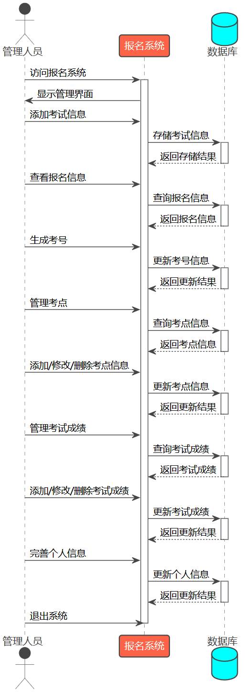

- [需求分析与系统设计](#需求分析与系统设计)
  - [需求分析](#需求分析)
    - [项目背景](#项目背景)
    - [任务概述](#任务概述)
      - [任务目标](#任务目标)
      - [用户特点](#用户特点)
      - [假定和约束](#假定和约束)
        - [假定](#假定)
        - [约束](#约束)
    - [业务描述](#业务描述)
      - [系统总业务流程图及其描述](#系统总业务流程图及其描述)
      - [各个子业务流程图及其描述](#各个子业务流程图及其描述)
        - [考生](#考生)
        - [教师](#教师)
        - [管理人员](#管理人员)
    - [数据需求](#数据需求)
      - [数据需求描述](#数据需求描述)
      - [数据流图](#数据流图)
      - [数据字典](#数据字典)
    - [功能需求](#功能需求)
      - [功能划分](#功能划分)
      - [功能描述](#功能描述)
        - [数据输入](#数据输入)
        - [数据输出](#数据输出)
        - [数据存储](#数据存储)
        - [数据更新](#数据更新)
        - [数据计算](#数据计算)
        - [远程建联](#远程建联)
    - [性能/非功能需求](#性能非功能需求)
      - [准确性](#准确性)
      - [及时性](#及时性)
      - [可扩充性](#可扩充性)
      - [易用性](#易用性)
      - [可用性](#可用性)
      - [依从性](#依从性)
      - [标准性](#标准性)
      - [先进性](#先进性)
      - [可维护性](#可维护性)
      - [安全性](#安全性)
  - [系统设计](#系统设计)
    - [顺序图设计](#顺序图设计)
      - [考生报名流程的顺序图设计](#考生报名流程的顺序图设计)
        - [顺序图设计](#顺序图设计-1)
        - [顺序图描述](#顺序图描述)
      - [教师上传试卷流程的顺序图设计](#教师上传试卷流程的顺序图设计)
        - [顺序图设计](#顺序图设计-2)
        - [顺序图描述](#顺序图描述-1)
      - [考生作答流程的顺序图设计](#考生作答流程的顺序图设计)
        - [顺序图设计](#顺序图设计-3)
        - [顺序图描述](#顺序图描述-2)
      - [管理人员管理流程的顺序图设计](#管理人员管理流程的顺序图设计)
        - [顺序图设计](#顺序图设计-4)
        - [顺序图描述](#顺序图描述-3)
      - [考生查询成绩流程的顺序图设计](#考生查询成绩流程的顺序图设计)
        - [顺序图设计](#顺序图设计-5)
        - [顺序图描述](#顺序图描述-4)
      - [考生、教师和管理人员处理成绩流程的顺序图设计](#考生教师和管理人员处理成绩流程的顺序图设计)
        - [顺序图设计](#顺序图设计-6)
        - [顺序图描述](#顺序图描述-5)
    - [协作图](#协作图)
      - [协作图设计](#协作图设计)
      - [协作图描述](#协作图描述)
    - [部署图](#部署图)
      - [部署图设计](#部署图设计)
      - [部署图描述](#部署图描述)

# 需求分析与系统设计

## 需求分析

### 项目背景

  六级报名系统是一个专门为解决中国大学生英语六级考试报名问题而设计的在线平台。大学英语六级考试在中国大学生的学术生涯中占有重要地位，它不仅是衡量学生英语能力的重要标准，也是许多学生毕业和就业的必要条件。然而，传统的报名方式存在许多问题，例如报名流程复杂，需要填写大量的表格和提交各种文件；信息更新不及时，考生往往需要等待很长时间才能获取到最新的考试信息；考生查询不便，需要通过电话或者亲自去报名点查询报名情况和考试成绩。

  为了解决这些问题，我们设计了六级报名系统。这个系统的目标是提供一个方便、高效、准确的报名方式。在这个系统中，考生可以方便地进行报名，查询报名情况和考试成绩；教师可以方便地上传试卷，查看考试信息；管理人员可以方便地进行考试管理，报名信息管理，用户管理，考点管理和考试成绩管理。

  六级报名系统的设计和实现，是为了提供一个全面的解决方案，以满足不同用户的需求。对于考生来说，他们可以通过简单的几步就完成报名，而不需要填写复杂的表格或提交各种文件。他们也可以随时查询报名情况和考试成绩，而不需要通过电话或亲自去报名点查询。对于教师来说，他们可以方便地上传试卷，查看考试信息，从而更好地为考生提供服务。对于管理人员来说，他们可以方便地进行考试管理，报名信息管理，用户管理，考点管理和考试成绩管理，从而提高工作效率。

  此外，六级报名系统还具有良好的扩展性，可以根据未来的需求添加更多的功能。例如，可以添加在线支付功能，让考生可以直接在系统中支付考试费用。也可以添加在线阅卷功能，让教师可以直接在系统中阅卷和打分。

  总的来说，六级报名系统是一个全面、高效、方便的解决方案，旨在提高大学英语六级考试的报名效率和质量，同时也为考生、教师和管理人员提供了一个方便、高效、准确的工作平台。

### 任务概述

#### 任务目标

  六级报名系统是一个基于在线平台的综合性应用系统，旨在为考生、教师和考试管理人员提供便捷的六级考试报名和管理服务。系统通过整合各项功能，实现了从考生信息注册、试题录入、报名和缴费，到线上考场答题、自动阅卷和教师阅卷，再到考试结果查询等全流程的自动化和数字化管理。系统的主要目标是提供一个高效、可靠且用户友好的平台，以简化六级考试相关流程，减少纸质工作和人工操作的繁琐性，并提升系统的安全性和数据的准确性。通过该系统，考生可以方便地完成报名和缴费，灵活选择考试时间和考点，参与线上答题并及时查询考试结果。教师可以管理试题、进行阅卷和评分，确保评分的客观性和准确性。考试管理人员可以对考试信息进行综合管理，并生成成绩报告。除此之外，系统将注重安全性和保密性，采用适当的身份验证和权限管理机制，确保用户的个人信息和考试数据不受未授权访问和篡改。

  总的来说，六级报名系统旨在建立一个高效、可靠、安全和用户友好的在线平台，为考生、教师和考试管理人员提供全面的六级考试报名和管理服务，实现报名流程的数字化、自动化和信息化，从而提升六级考试的效率和质量。更细化地看，我们可以从如下几个方面进行解析：

1. 实现用户信息管理功能：
   - 允许考生、教师和考试管理人员注册账号，并提供相应的登录功能。
   - 考生可以填写个人信息并随时修改，包括姓名、身份证号、联系方式等。同时系统还支持上传的身份头像。
   - 系统应采用安全的加密方式对用户信息进行存储和传输，确保信息的安全性和可靠性。
   - 支持用户权限管理，根据用户角色进行权限设置和管理，确保不同用户只能访问其权限范围内的功能和数据。
2. 实现试题管理功能：
   - 教师可以录入新的试题，包括题目、选项、答案和难度等信息。
   - 教师可以对已有试题进行修改和删除。
   - 系统应提供试题分类和标签功能，方便教师进行试题管理和检索。
   - 确保试题信息的准确性和及时性，及时更新和维护试题库。
3. 实现报名管理功能：
   - 考生可以在线填写报名表格并上传必要的材料。
   - 系统应提供考试日期、考点及报名费用等信息的查询功能。
   - 系统应具备新增考点的功能。
   - 考生可以在线缴纳报名费用，并生成相应的缴费凭证。
   - 考试管理人员可以审核考生的报名信息，并对不符合条件的报名进行处理。
4. 实现考试发布功能：
   - 管理员应可以录入考试信息表，添加考试名称、简介、考试时间等相关信息。
   - 老师和学生应可以在自己的系统页面查看到发布的考试信息。

5. 实现线上考场功能：

   - 系统应提供线上考场界面，显示考试题目和答题界面。

   - 考生可以在规定时间内进入线上考场进行答题。

   - 系统应提供计时和倒计时功能，确保考试时间的控制和监督。

   - 考生提交答卷后，系统应自动保存答卷并进行自动阅卷。

6. 实现阅卷与成绩管理功能：

   - 系统应具备自动阅卷功能，可以根据试题答案自动评定考生答案的得分。

   - 教师可以对答卷进行人工阅卷，评定考生答案的得分，并记录评分结果。

   - 考试管理人员可以生成考试成绩和成绩报告，并将其公布给考生。
   - 考试管理人员在得到指示的情形下，可以对有误的成绩进行一个更改。

   - 考生可以查询自己的考试成绩和通过与否的结果。

7. 实现系统安全性和性能要求：

   - 系统应采用安全的身份验证机制，确保用户信息的安全性。

   - 系统具有隔离性，根据不同用户的权限，施加不同访问范围。

   - 系统应具备高并发和大流量的处理能力，确保在考试期间系统的稳定性和性能。

#### 用户特点

  对于考生角色：

- 考生是系统的主要用户，他们希望能够方便地进行六级考试的报名和管理操作。
- 考生通常具有不同的背景和需求，包括不同的学习风格、时间安排和考试准备方式。
- 考生希望系统提供清晰的界面和简洁的操作流程，以便注册账号、填写个人信息、选择考试时间和地点，以及查询考试结果。
- 系统应支持考生上传必要的材料，如身份证或照片等，以满足报名要求。
- 考生希望系统提供可靠的在线支付功能，方便缴纳报名费用。

对于教师角色：

- 教师在六级报名系统中扮演的角色主要是试题录入和阅卷。
- 教师通常具有丰富的英语教学经验和专业知识，需要使用系统录入新的试题和修改已有试题。
- 教师希望系统提供方便的试题录入界面，包括题目、选项、答案和难度等信息的输入。
- 系统应支持试题的分类和标签，方便教师进行试题管理和检索。
- 教师希望系统提供可靠的阅卷功能，以便进行考生答案的评分和记录。

对于考试管理人员角色：

- 考试管理人员是系统的管理员角色，负责系统的运行和管理。
- 考试管理人员需要管理考试的日期、考点、报名费用等信息，确保这些信息的准确性和及时性。
- 考试管理人员需要审核考生的报名信息，并对不符合条件的报名进行处理。
- 系统应提供可靠的成绩管理功能，包括生成考试成绩和成绩报告。
- 考试管理人员希望系统提供良好的数据管理能力，包括考生信息、报名信息和成绩信息的录入、修改和删除。

  六级报名系统的用户涵盖了考生、教师和考试管理人员三个角色。考生期望系统提供便捷的报名和管理操作，教师期望系统支持试题录入和阅卷功能，而考试管理人员需要系统提供全面的考试信息管理和成绩管理功能。通过了解用户特点有助于我们更好地满足用户需求，提供优质的用户体验和功能完整性。

#### 假定和约束

##### 假定

  下面我们着力于六级报名系统的假定，并对之进行较为详细的分析：

1. **用户假定**：我们假定考生具备基本的互联网操作技能，能理解和遵守系统的报名、缴费以及考试流程。我们同时假定教师和考试管理人员对系统功能具有完全理解，能正确录入试题、管理考试和阅卷。
2. **技术假定**：我们假定所有的用户都有稳定可靠的互联网连接，可以无障碍地进行注册、报名、缴费以等操作。
3. **安全假定**：我们假定所有用户都会妥善保管自己的账户信息，并遵守诚实原则进行六级考试，不使用任何作弊手段。
4. **发布假定**：我们假定对于管理人员能够及时发布相关的考试信息、考点情况等，方便监考老师、考生的参考。
5. **责任假定**：我们假定考试管理人员能够负责任地处理可能出现的任何问题，包括技术问题、用户问题以及考试安排问题。
6. **协调假定**：我们假定管理人员能够协调各方资源，包括教师、考生和技术支持，以确保考试的顺利进行。
7. **技术熟练度假定**：我们假定教师能够熟练地使用系统进行试题录入和阅卷等操作。
8. **敬业假定**：我们假定教师会尽职尽责，公正公平地进行阅卷工作。
9. **协作假定**：我们假定教师会与考试管理人员有效协作，按时完成试题录入和阅卷等任务。
10. **错误修正假定**：我们假定学生发现错误会及时和教师反映，教师会积极和管理人员进行沟通，对考试成绩进行相应的修订。

##### 约束

  下面我们着力于六级报名系统的约束，并对之进行较为详细的分析：

1. **技术约束**：六级报名系统应在所有主流浏览器的最新版本上运行，包括但不限于Google Chrome、Firefox、Safari和Microsoft Edge。系统应该适应不同的屏幕尺寸和分辨率，从手机到台式电脑都应保持良好的用户体验。系统的后端需要优化，以在报名高峰期处理大量并发请求。
2. **考生用户约束**：
   - **信息提供**：考生需要提供准确的个人信息和联系方式以完成报名，包括但不限于姓名、学号、身份证号、邮箱地址、手机号等。
   - **缴费**：考生需要使用支持的在线支付方式完成缴费，包括但不限于信用卡、借记卡、支付宝、微信支付等。
   - **报名时间**：考生需要在规定的报名时间内完成报名和缴费。逾期未支付将视为放弃报名。
3. **教师用户约束**：
   - **试题录入**：教师需要在规定的时间内完成试题录入，并且确保试题的准确性和合理性。
   - **阅卷**：教师需要在考试结束后的规定时间内完成阅卷工作，并且应公正、公平地评分。
4. **管理人员用户约束**：
   - **信息发布**：管理人员需要及时发布考试相关信息，包括但不限于报名时间、考试时间、考试地点、考试规则等。
   - **用户支持**：管理人员需要在用户遇到问题时提供帮助，包括但不限于账号问题、支付问题、信息更改请求等。
5. **法规约束**：六级报名系统需要符合所有相关的数据保护和隐私法规，如《中华人民共和国网络安全法》和《中华人民共和国个人信息保护法》。任何个人信息的收集、存储和使用都应遵循这些法规。
6. **数据约束**：六级报名系统需要提供数据备份和恢复机制，以防止任何可能的数据丢失或损坏。数据的备份应定期进行，并应在安全的环境下存储备份数据。
7. **安全约束**：所有的用户都应遵守安全策略，包括但不限于保管好个人账号信息、不共享账号信息、定期修改密码等。此外，系统应提供适当的安全防护，如防止SQL注入、跨站脚本攻击（XSS）等。
8. **人力资源约束**：管理人员需要有足够的人手来处理用户的咨询和问题，特别是在报名期间。此外，教师也需要有足够的时间和精力来完成试题录入和阅卷工作。
9. **地理约束**：考试的地点需要提前公布，并且管理人员需要确保考点有足够的设施和人员来支持考试的顺利进行。考试地点的选择应考虑到交通便利性和学生的分布情况。

### 业务描述

  在该部分中，我们将会对六级报名系统进行业务描述，我们先从系统总业务流程图入手，对整体观进行解析。再分别从不同角色入手，以角色属性不同对子业务流程图进行归设计描述。

  #### 系统总业务流程图及其描述

  如下图所示，是我们的系统总业务流程图：

1. 对于**考生**而言，其相关主要业务有：
   - **注册和登录**：考生首先需要在系统中注册一个账户，然后通过登录系统来使用各种功能。
   - **完善个人信息**：考生可以在系统中完善他们的个人信息，包括上传头像等。
   - **报名**：考生可以在系统中进行考试报名，选择他们想要参加的考试。
   - **查看报名情况**：考生可以查看他们的报名情况，包括是否已经报名，是否已经缴费，以及是否已经考试。
   - **成绩查询**：考生可以在系统中查询他们的考试成绩。
   - **登出**：完成所有操作后，考生可以登出系统。
2. 对于**教师**而言，其相关主要业务有：
   - **注册和登录**：教师也需要在系统中注册和登录。
   - **上传试卷**：教师可以在系统中上传试卷，这些试卷可以作为考生的练习材料。
   - **查看考试信息**：教师可以查看相关的考试信息，这对于监考非常有帮助。
   - **进行阅卷**：教师也可以在系统中进行阅卷(系统固然可以自动阅卷，但是如果出现特殊情况，教师也可以手动阅卷)。
   - **查看学生成绩**：教师可以查看他们学生的考试成绩，了解学生的学习情况。如果成绩出现异常情况，可以协调管理人员对学生的成绩进行修改调整。
   - **登出**：完成所有操作后，教师可以登出系统。
3. 对于**管理人员**而言，其相关主要业务有：
   - **注册和登录**：管理人员需要在系统中注册和登录。
   - **考试管理**：管理人员可以查看考试列表，过期考试列表，以及添加新的考试。
   - **报名信息管理**：管理人员可以查看每个考生的付费情况和成绩，以及生成考号。
   - **用户管理**：管理人员可以进行用户管理，包括考生和教师的信息管理。
   - **考点管理和考场编排**：管理人员可以查看考点列表，进行考点的增删改查，以及新增考点和考场编排。
   - **考试成绩管理**：管理人员可以对考试成绩进行增删改查。
   - **完善个人信息**：管理人员也可以在系统中完善他们的个人信息，包括上传头像等。
   - **登出**：完成所有操作后，管理人员可以登出系统。

#### 各个子业务流程图及其描述

  对于各个子业务流程图，我们分别从考生、教师、管理人员的角色身份入手，进行一个子业务流程的分析。

##### 考生

  如下图所示，是考生的子业务流程图：

  以下是对考生在六级报名系统中的子业务流程的详细描述：

1. **注册**：考生首先需要在系统中进行注册。这个过程通常包括提供一些基本信息，如姓名、邮箱、密码等。注册成功后，考生将拥有一个系统账户。
2. **登录**：注册成功后，考生需要通过输入他们的邮箱和密码来登录系统。登录成功后，考生将能够访问系统的各种功能。
3. **完善个人信息**：登录系统后，考生可以在个人信息页面中完善他们的个人信息。这可能包括他们的联系方式、地址、学校信息等。此外，考生还可以上传他们的头像。
4. **报名**：考生可以在系统中进行考试报名。这个过程通常包括选择他们想要参加的考试，以及填写一些必要的报名信息。报名成功后，考生将能够参加他们选择的考试。
5. **查看报名情况**：考生可以在系统中查看他们的报名情况。这可能包括他们是否已经报名，是否已经缴费，以及是否已经考试。这些信息可以帮助考生了解他们的考试状态。
6. **成绩查询**：考试结束后，考生可以在系统中查询他们的考试成绩。这个过程通常包括输入他们的考号和身份信息，然后系统将显示他们的考试成绩。
7. **协调商榷**：如果发现自己的考试成绩严重偏离了自己的预期，可以去找老师或者管理人员进行商榷探讨，但是如果找的是老师的情形下，老师无法直接修改，老师需要找管理人员进行修改。
8. **登出**：完成所有操作后，考生可以选择登出系统。这将结束他们的系统会话，并保护他们的个人信息安全。

##### 教师

   如下图所示，是教师的子业务流程图：

  以下是对教师在六级报名系统中的子业务流程的详细描述：

1. **注册**：教师首先需要在系统中进行注册。这个过程通常包括提供一些基本信息，如姓名、邮箱、密码等。注册成功后，教师将拥有一个系统账户。
2. **登录**：注册成功后，教师需要通过输入他们的邮箱和密码来登录系统。登录成功后，教师将能够访问系统的各种功能。
3. **上传试卷**：登录系统后，教师可以在试卷上传系统中上传试卷。这些试卷可以作为考生的练习材料。上传试卷的过程可能包括选择试卷文件，设置试卷的相关信息，如试卷名称、试卷类型等。
4. **查看考试信息**：教师可以在考试信息系统中查看相关的考试信息。这对于监考非常有帮助。查看考试信息的过程可能包括查看考试列表，查看每个考试的详细信息，如考试时间、考试地点等。
5. **查看学生成绩**：教师可以在学生成绩系统中查看他们学生的考试成绩。这可以帮助教师了解学生的学习情况。查看学生成绩的过程可能包括选择学生，查看学生的考试成绩，查看学生的考试答案等。此外，如果学生反映成绩和实际情况有较大出入，老师在审查完毕以后，发现确实如学生所言，可以和管理人员协调对成绩进行相应修改。
6. **登出**：完成所有操作后，教师可以选择登出系统。这将结束他们的系统会话，并保护他们的个人信息安全。

##### 管理人员

  如下图所示，是管理人员的子业务流程图：

  以下是对管理人员在六级报名系统中的子业务流程的详细描述：

1. **注册**：管理人员首先需要在系统中进行注册。这个过程通常包括提供一些基本信息，如姓名、邮箱、密码等。注册成功后，管理人员将拥有一个系统账户。
2. **登录**：注册成功后，管理人员需要通过输入他们的邮箱和密码来登录系统。登录成功后，管理人员将能够访问系统的各种功能。
3. **考试管理**：登录系统后，管理人员可以在考试管理系统中进行各种操作。这可能包括查看考试列表，查看过期考试列表，以及添加新的考试。
4. **报名信息管理**：管理人员可以在报名信息管理系统中查看每个考生的付费情况和成绩。此外，他们还可以生成考号。
5. **用户管理**：管理人员可以在用户管理系统中进行用户管理。这可能包括查看用户列表，查看用户的详细信息，以及进行用户的增删改查。
6. **考点管理和考场编排**：管理人员可以在考点管理系统中进行各种操作。这可能包括查看考点列表，进行考点的增删改查，以及新增考点。此外，他们还可以进行考场编排。
7. **考试成绩管理**：管理人员可以在考试成绩管理系统中对考试成绩进行增删改查。这可能包括查看成绩列表，查看成绩的详细信息，以及进行成绩的增删改查。
8. **完善个人信息**：管理人员也可以在系统中完善他们的个人信息。这可能包括他们的联系方式、地址、头像等。
9. **登出**：完成所有操作后，管理人员可以选择登出系统。这将结束他们的系统会话，并保护他们的个人信息安全。

### 数据需求
#### 数据需求描述
根据上述业务流程，需要有以下几类数据需求：
1. **用户**
本系统拥有三大用户类型，分别为考生、教师、管理人员。其中，用户均需要以下数据来使用系统进行相关操作。用户均需要以下数据来使用系统进行相关操作。
- id：记录每类用户在系统中的id，不能为空。
- 姓名：记录用户的真实姓名，不能为空。
- 账户名：记录用户注册的账户名称，不能为空。
- 账户密码：记录用户的登陆密码，不能为空。
- 性别：记录用户的性别，不能为空。
- 身份证号：记录用户的身份证号，不能为空。
- 教育背景：记录用户的最高学历，不能为空。
- 户籍地址：记录用户的户籍地址，不能为空。
- 邮箱：记录用户的邮箱。
- 电话号码：记录用户的手机号码，长度为 11 位。
- 证件照：记录用户的近期有效证件照。
- 角色：区分用户的类型，用户类型：0-管理员，1-老师，2-考生。
2. **考点信息**
- id：记录考点在系统中的id。
- 考点编号：前三位为考点名，后两位为考室名。
- 考点名称：记录考点的名称。不能为空。
- 考室数量：记录该考点的考室数量。
- 归属区域：记录考点的归属区域。
3. **报考信息**
- 个人考试项信息id：记录考试在系统内的id。
- 考生id：记录考生的id。
- 考试id：记录考试的id。
- 支付状态：记录本场考试的支付情况，支付:0未支付，1支付。
- 考试分数：记录本场考试的考试成绩，负数为缺考。
- 考试时间：记录本场考试的考试时间。
- 考号：由四部分组成，地点号+考点号+考室号+座位号
- 考场号：即考点编号。
- 考试地点：记录考试地点。
4. **考试信息**
- 考试id：记录本场考试在系统中的id。
- 考试名称：记录考试的名称。
- 考试描述：关于考试信息描述。
- 考试时间：记录考室的时间。
- 过期标志：过期标志，0未过期，1过期。
5. **地址信息**
- 地址id：每个地址在系统中的id。
- 地址编号：每个地址在系统中的编号。
- 省份：该地址隶属的省份。
- 城市：该地址隶属的城市。
6. **填空题信息**
- 填空题id：每个填空题在系统中的id。
- 试卷id：每套试卷在系统中的id。
- 题干内容：问题具体信息描述。
- 正确答案：问题对应的正确答案。
7. **填空题答案信息**
- 填空答案id：每个学生每道填空题作答情况在系统中的id。
- 学生id：该答案对应作答学生的id。
- 试卷id：该答案对应题目隶属的试卷id。
- 题目id：该答案对应题目的id。
- 作答内容：填空题答案的内容。
8. **选择题信息**
- 选择题id：每个选择题在系统中的id。
- 试卷id：每套试卷在系统中的id。
- 选项A：该选择题的A选项。
- 选项B：该选择题的B选项。
- 选项C：该选择题的C选项。
- 选项D：该选择题的D选项。
9. **选择题答案信息**
- 选择答案id：每个学生每道选择题作答情况在系统中的id。
- 学生id：该答案对应作答学生的id。
- 试卷id：该答案对应题目隶属的试卷id。
- 题目id：该答案对应题目的id。
- 作答内容：选择题答案的内容。
#### 数据流图
根据以上的数据需求描述进行数据流图的绘制，共分为三层，包括顶层数据流图、第 0 层数据流图、第 1 层数据流图。其中，每层的基本符号都使用如下标准：

1. 顶层数据流图
2. 第0层数据流图
3. 第1层数据流图
#### 数据字典
根据数据需求描述，提供以下数据字典：
1. 用户表数据字典

   

   具体如下：

  > 数据元素编号：DE001
            数据元素名称：用户
            别 名：考生/教师/ 管 理 人 员
            简述：系 统 面 对 的 三 大 用 户 类 型
            组成：Id int
                         姓名 varchar(45)
                         账户名 varchar(45)
                         账户密码 varchar(45)
                         性别 char(2)
                         身份证号 varchar(45)
                         教育背景 varchar(45)
                         户籍地址 int
                         邮箱 varchar(45)
                         电话号码 varchar(11)
                         证件照 varchar(255)
                         角色 smallint
    有关处理逻辑：根据角色区分三大用户类型，对应三种不同权限

2. 考点信息数据字典

   
   
    具体如下：
   
   > 数 据 元 素 编 号：DE002
   > 数 据 元 素 名 称： 考点信息
   > 别名：考试所开设考点的详细信息
   > 组成：Id int
   >               考点编号 varchar(5)
   >               考点名称 varchar(45)
   >               考室数量 int
   >               归属区域 int
   > 有关处理逻辑： 记录所有考点的信息，以供查阅和相关权限人员的增删改查

3. 报考信息数据字典

   

   具体如下：

   > 数 据 元 素 编 号：DE003
   > 数 据 元 素 名 称： 报考
   > 简 述： 学 生 进 行 报考操 作 后 的 记 录
   > 组成：个人考试项信息id int
   >            考生id int
   >            考试id int
   >            支付状态 tinyint
   >            考试分数 int
   >            考试时间 date
   >            考号 varchar(12)
   >            考场号 varchar(12)
   >            考试地点 varchar(45)
   >
   > 有关处理逻辑： 记录所有报考的信息，以供查阅和相关权限人员的增删改查

4. 考试信息数据字典

   

   具体如下：
   > 数 据 元 素 编 号：DE004
   > 数 据 元 素 名 称： 考试信息
   > 别 名：系统内所有考试的信息
   > 简 述： 该考试可供考生选择
   > 组成：考试id int
   >                考试名称 varchar(45)
   >                考试描述 varchar(3000)
   >                考试时间 datetime
   >                过期标志 tinyint
   > 有关处理逻辑： 记录所有考试的信息，以供查阅和相关权限人员的增删改查

5. 地址信息数据字典

   

   具体如下：
   > 数 据 元 素 编 号：DE005
   > 数 据 元 素 名 称： 地址信息
   > 别 名：系统内所有地址的信息
   > 组 成：地址id int
   >                 地址编号 varchar(3)
   >                 省份 varchar(45)
   >                 城市 varchar(45)
   > 有关处理逻辑： 记录所有地址的信息，以供查阅和相关权限人员的增删改查 

6. 填空题信息数据字典

   

   具体如下：
   > 数 据 元 素 编 号：DE006
   > 数 据 元 素 名 称： 填空题信息
   > 简 述： 系统内所有填空题的信息
   > 组 成：填空题id int
   > 试卷id int
   > 题干内容 varchar(500)
   > 正确答案 varchar(500)
   > 有关处理逻辑： 记录所有填空题的信息，以供查阅和相关权限人员的增删改查

7. 填空题答案信息数据字典

   

   具体如下：
   > 数 据 元 素 编 号：DE007
   > 数 据 元 素 名 称： 填空题答案信息
   > 简 述： 系统内所有填空题答案的信息
   > 组 成：填空题答案id int
   > 学生id int
   > 试卷id int
   > 题目id int
   > 作答内容 varchar(100)
   > 有关处理逻辑： 记录所有填空题答案的信息，以供查阅和相关权限人员的增删改查

8. 选择题信息数据字典

   
   
   具体如下：
   > 数 据 元 素 编 号：DE008
   > 数 据 元 素 名 称： 选择题信息
   > 简 述： 系统内所有选择题的信息
   > 组 成：选择题id int
   > 试卷id int
   > 题干内容 varchar(500)
   > 正确答案 varchar(200)
   > 选项A varchar(200)
   > 选项B varchar(200)
   > 选项C varchar(200)
   > 选项D varchar(200)
   > 有关处理逻辑： 记录所有填空题的信息，以供查阅和相关权限人员的增删改查
   
9. 填空题答案信息数据字典

​                                     

​    具体如下：

  > 数 据 元 素 编 号：DE007
   >         数 据 元 素 名 称： 填空题答案信息
   >         简 述： 系统内所有填空题答案的信息
   >         组 成：填空题答案id int
   >         学生id int
   >         试卷id int
   >         题目id int
   >         作答内容 varchar(100)
   >         有关处理逻辑： 记录所有填空题答案的信息，以供查阅和相关权限人员的增删改查

### 功能需求

#### 功能划分

该系统根据实现目的需要有以下六个功能：数据输入、数据输出、数据存储、数据更新、数据计算、远程建联。

#### 功能描述

##### 数据输入

数据输入主要通过键盘操作进行，用于用户提供给系统一些数据信息。有以下主要应用场景：

1. 用户进入登陆页面时，无论是选择直接登陆还是开始注册，可通过键盘进行相关的数据输入，登进主界面；根据系统采用安全的身份验证机制，输入相关的验证信息。
2. 用户填写个人信息并随时修改，包括姓名、身份证号、联系方式等。
3. 用户类型教师录入新的试题，包括题目、选项、答案和难度等信息；输入相关信息进行试题管理和检索；进行人工阅卷时录入相关的评分结果。
4. 用户类型考生在线填写报名表格；在规定时间内进入线上考场实现答题信息的录入。
5. 用户类型考试管理人员录入考试信息表，添加考试名称、简介、考试时间等相关信息；更改有误的成绩。
6. 其他需要输入数据的场景。

##### 数据输出

数据输出主要通过数据库与输入信息的交互进行，用于系统提供给用户一些数据信息。有以下主要应用场景：

1. 用户类型教师进行试题管理和检索、查询成绩等情形时，返回数据库中与关键字相关的数据。
2. 用户类型考生查询考试信息、查询成绩等情形时，返回数据库中与关键字相关的数据。
3. 用户类型考试管理人员查询考生报名信息等情形时，返回数据库中与关键字相关的数据。
4. 其他需要数据反馈的场景。

##### 数据存储

在用户进行数据输入的操作之后，首先判断对应的数据库中是否已存储相关信息，若无，则输入的数据被存入对应数据库。

##### 数据更新

在用户进行数据输入的操作之后，首先判断对应的数据库中是否已存储相关信息，若有，则输入的数据更新先前的记录；若无，则进行新数据的存储。

若用户进行数据的删除操作，则在对应数据库中删除对应的信息。

##### 数据计算

在需要进行数据计算的数据库中插入对应的公式进行计算。有以下主要应用场景：

1. 统计学生相关成绩信息，进行求和、平均、加权计算等。
2. 统计学生、教师、考场数量等，进行求和运算。
3. 计时和倒计时功能，计算考试时间。
4. 其他需要数据计算的情形。

##### 远程建联

系统采用安全的身份验证机制，与远程邮箱、手机建联，发送相关验证信息进行登陆或注册验证。

### 性能/非功能需求

为满足以上系统功能需求，系统应当满足以下的一些约束条件：

#### 准确性

在进行数据的相关操作时，比如输入、输出、更新等，需要保证系统在这些数据进行传递的时刻是稳定不变的，并且得到对应的反馈也应当是准确的。

#### 及时性

在用户对系统执行操作时，系统的一般操作相应时间应该不超过2秒，系统涉及数据连接的操作相应时间以及给出反馈的时间应该不超过5秒。即使在用户流量特别庞大且集中的时刻，也应当能够在尽可能少的时间内给出正确的反馈。

在系统因为访问人数过多而发生宕机时，本系统应该在10分钟之内可以进行恢复。

#### 可扩充性

系统在基本配置基础上具有直接扩充硬件（主要是外设）数量，内存容量等的能力；系统有能够及时更新、扩充基本功能的能力。

本系统应该保证在市面上常用的系统环境下便于进行安装使用，不会因为环境的不同而导致系统的崩溃或者时系统功能的缺失。 本系统的接口设计合理，便于进行系统的改造和重用，应该方便被当作模板框架来进行相应其他系统的二次开发。 本系统在和其他系统在同一个平台下面进行运行的时候，不会产生冲突，各自有条不紊的运行。

#### 易用性

系统界面美观，吸引使用者。本系统的界面设计应该在保证基本功能的基础上做到布局美观友好，系统界面和市场面上大部分管理系统界面类似，用户的体验性在本系统的界面设计上应该充分提高。本系统易于学习。本系统应该保证新用户在初次使用时，在不超过3分钟的学习时间之内便可以明白整个系统的基本功能，在5分钟的学习时间之内该用户应该熟练掌握系统的全部功能。

#### 可用性

用户使用本系统工作效率得到提高。在接收了用户错误的数据输入之后，本系统能不死机、不崩溃，依然正常工作。本系统应该可以进行错误识别并且给出用户相应的提示信息。 

当系统无法安装时，用户可以查看帮助手册，安装相关软件或者修复受损文件。

当系统停止运行时，强行关机重启后，用户可以根据系统的自动备份或者在操作之前的手工备份来恢复数据，保证系统数据的正确性。

#### 依从性

系统对国家法律、国际公约、社交法则、文化与政治习惯、标准等环境约束的要求均可满足。

#### 标准性

本系统遵循相关的法规和标准，在开发计算机硬件、软件等基本设计时，符合市场上的标准和规范。

#### 先进性

系统的设计语言等基本设计使用最先进的语法规范，同时满足的功能以及操作方式也符合项目设计现今最先进的标准。

#### 可维护性

在系统运行的过程之中，系统容易诊断出缺陷和失效问题，并且给出行相应的运行时提示。 本系统的的代码和文档结构同样应该保证清晰易读，便于在系统主线错误之后进行快速的回复修改，能准确的找出系统错误的原因。 在进行系统升级的时候，应该进行版本的控制，减少不必要的功能升级，防止因为升级修改次数越多系统越不稳定现象的发生。 本系统耦合度低，便于完成后期系统测试。

#### 安全性

本系统应该对使用者的权限进行控制。进行系统的登录时，不同类型的使用者应该具有不同的系统使用权限。本系统的系统管理员管理拥有实现对于不同角色开放不同功能的能力，来防止不合法的操作的产生。 本系统对于重要数据应该进行数据加密。初次登录系统时，应该输入相应的用户名和密码，对于密码的存储应该采取一定的加密措施，防止因为管理员不适当的信息泄露而产生不可挽回的错误。 系统数据定期备份。为了本成绩管理系统的长远考虑，系统数据应该进行相应的备份，防止在系统停止工作时能保证进行数据恢复。

## 系统设计

### 顺序图设计

#### 考生报名流程的顺序图设计

##### 顺序图设计

  考生报名流程的顺序图的设计如下所示：

##### 顺序图描述

  上面的顺序图详细描述了考生在六级报名系统中的一系列操作和系统的响应：

1. **访问报名系统**：考生首先访问报名系统，系统会显示报名表单。
2. **填写报名表单**：考生在报名表单中填写个人信息，包括姓名、学号、考试科目等。
3. **存储报名信息**：报名系统将考生的报名信息存储在数据库中。
4. **显示支付信息**：报名系统会显示支付信息，引导考生进行支付。
5. **进行支付**：考生通过支付系统进行支付。
6. **更新支付状态**：支付系统返回支付结果后，报名系统会在数据库中更新考生的支付状态。
7. **确认支付并提交报名表单**：报名系统确认支付成功后，向考生返回提交报名表单的确认信息。
8. **查看报名状态**：考生可以在报名系统中查看自己的报名状态。
9. **查询报名状态**：报名系统会在数据库中查询考生的报名状态，并返回给考生。
10. **查看支付状态**：考生可以在报名系统中查看自己的支付状态。
11. **查询支付状态**：报名系统会在数据库中查询考生的支付状态，并返回给考生。
12. **查看考试信息**：考生可以在报名系统中查看考试的相关信息。
13. **查询考试信息**：报名系统会在数据库中查询考试的相关信息，并返回给考生。
14. **查看考点信息**：考生可以在报名系统中查看考点的相关信息。
15. **查询考点信息**：报名系统会在数据库中查询考点的相关信息，并返回给考生。
16. **参加考试**：考生在报名系统中点击参加考试。
17. **更新考试状态**：报名系统会在数据库中更新考生的考试状态。
18. **返回已考试状态**：报名系统会向考生返回已考试的状态。

#### 教师上传试卷流程的顺序图设计

##### 顺序图设计

  教师上传试卷流程的顺序图如下所示：

##### 顺序图描述

  上面的顺序图详细描述了教师在六级报名系统中上传试卷的一系列操作和系统的响应：

1. **访问报名系统**：教师首先访问报名系统，系统会显示试卷上传界面。
2. **选择试卷文件**：教师在试卷上传界面中选择需要上传的试卷文件。
3. **存储试卷信息**：报名系统将教师上传的试卷信息存储在数据库中。
4. **显示试卷预览**：报名系统会显示试卷的预览，让教师确认试卷的内容。
5. **确认上传**：教师确认试卷无误后，点击确认上传。
6. **更新试卷状态**：报名系统在数据库中更新试卷的状态，标记为已上传。
7. **返回上传成功信息**：报名系统向教师返回试卷上传成功的信息。

#### 考生作答流程的顺序图设计

##### 顺序图设计

  考生作答流程的顺序图如下所示：

##### 顺序图描述

  以上的顺序图详细描述了考生在六级报名系统中作答教师上传试卷的一系列操作和系统的响应：

1. **访问报名系统**：考生首先访问报名系统。
2. **查询试卷信息**：报名系统会在数据库中查询教师上传的试卷信息。
3. **显示试卷**：报名系统将查询到的试卷信息显示给考生。
4. **选择答案**：考生在试卷中选择自己的答案。
5. **存储答案**：报名系统将考生选择的答案存储在数据库中。
6. **提交试卷**：考生完成答题后，点击提交试卷。
7. **更新试卷状态**：报名系统在数据库中更新考生的试卷状态，标记为已提交。
8. **查询正确答案**：报名系统在数据库中查询试卷的正确答案。
9. **返回提交成功信息和正确答案**：报名系统向考生返回试卷提交成功的信息和试卷的正确答案。

#### 管理人员管理流程的顺序图设计

##### 顺序图设计

  管理人员管理流程的顺序图如下所示：

##### 顺序图描述

  上面的顺序图详细描述了管理人员在六级报名系统中的一系列操作和系统的响应：

1. **访问报名系统**：管理人员首先访问报名系统，系统会显示管理界面。
2. **添加考试信息**：管理人员在管理界面中添加考试信息。
3. **存储考试信息**：报名系统将管理人员添加的考试信息存储在数据库中。
4. **查看报名信息**：管理人员可以在管理界面中查看报名信息。
5. **查询报名信息**：报名系统会在数据库中查询报名信息，并返回给管理人员。
6. **生成考号**：管理人员可以在管理界面中生成考号。
7. **更新考号信息**：报名系统会在数据库中更新考号信息。
8. **管理考点**：管理人员可以在管理界面中管理考点，包括查看考点信息、添加考点、修改考点信息和删除考点。
9. **查询考点信息**：报名系统会在数据库中查询考点信息，并返回给管理人员。
10. **更新考点信息**：管理人员添加、修改或删除考点信息后，报名系统会在数据库中更新考点信息。
11. **管理考试成绩**：管理人员可以在管理界面中管理考试成绩，包括查看考试成绩、添加考试成绩、修改考试成绩和删除考试成绩。
12. **查询考试成绩**：报名系统会在数据库中查询考试成绩，并返回给管理人员。
13. **更新考试成绩**：管理人员添加、修改或删除考试成绩后，报名系统会在数据库中更新考试成绩。
14. **完善个人信息**：管理人员可以在管理界面中完善自己的个人信息。
15. **更新个人信息**：报名系统会在数据库中更新管理人员的个人信息。
16. **退出系统**：管理人员完成所有操作后，可以选择退出系统。

#### 考生查询成绩流程的顺序图设计

##### 顺序图设计

  考生查询成绩的流程的顺序图如下所示：

##### 顺序图描述

  上面的顺序图详细描述了考生查询成绩的流程：

1. **访问报名系统**：考生首先访问报名系统。
2. **显示查询界面**：报名系统会显示一个查询界面，供考生输入查询请求。
3. **请求查询成绩**：考生在查询界面中输入请求，要求查询自己的考试成绩。
4. **查询成绩**：报名系统接收到考生的查询请求后，会在数据库中查询考生的成绩。
5. **返回成绩信息**：数据库将查询到的成绩信息返回给报名系统。
6. **显示成绩信息**：报名系统将查询到的成绩信息显示给考生。

#### 考生、教师和管理人员处理成绩流程的顺序图设计

##### 顺序图设计

考生、教师和管理人员处理成绩流程的顺序图如下所示：

##### 顺序图描述

  上面的顺序图详细地描述了考生、教师和管理人员在六级报名系统中处理成绩问题的操作流程，以及报名系统和数据库之间的交互过程。

1. **反映成绩有误**：考生首先向教师反映自己的成绩有误。
2. **访问报名系统**：教师在接收到考生的反映后，访问报名系统。
3. **显示查询界面**：报名系统会显示一个查询界面，供教师输入查询请求。
4. **请求查询成绩**：教师在查询界面中输入请求，要求查询学生的考试成绩。
5. **查询成绩**：报名系统接收到教师的查询请求后，会在数据库中查询学生的成绩。
6. **返回成绩信息**：数据库将查询到的成绩信息返回给报名系统。
7. **显示成绩信息**：报名系统将查询到的成绩信息显示给教师。
8. **请求修改成绩**：如果教师核查后发现成绩确实有误，可以在系统中请求修改成绩。
9. **请求确认修改**：报名系统接收到教师的修改请求后，会向管理人员发送请求，要求确认修改。
10. **确认修改**：管理人员在接收到修改请求后，确认修改。
11. **修改成绩**：报名系统在接收到管理人员的确认后，会在数据库中修改学生的成绩。
12. **返回修改结果**：数据库将修改结果返回给报名系统。
13. **显示修改结果**：报名系统将修改结果显示给教师以及考生。

### 协作图

#### 协作图设计

  以下是我们六级报名系统的协作图设计：

#### 协作图描述

  上文设计的六级报名系统的协作图主要描述了考生、教师和管理人员在系统中的交互过程，以及系统与数据库之间的交互。以下是详细的叙述：

  首先是**考生报名流程**，考生首先访问报名系统，这是他们与系统的第一次交互。报名系统会显示一个报名表单，这个表单包含了考生需要确认的信息。考生在完成后，会被引导至支付系统进行支付。支付系统是一个独立的系统，它负责处理所有的支付请求。考生在支付系统中完成支付后，支付系统会返回支付结果给报名系统。这个结果包含了支付是否成功的信息。报名系统在接收到支付结果后，会将这个结果反馈给考生。这样，考生就可以知道他们的支付是否成功。在这个过程中，考生可以在系统中查看他们的报名和支付状态。这两个状态是考生在报名过程中最关心的信息。如果状态显示为已报名和已缴费，那么考生就可以确认他们已经成功报名。考试结束后，考生可以在系统中查看自己的考试状态，这个状态会告诉考生他们的考试是否已经完成。

  其次是**教师上传试卷流程**，教师也是报名系统的一个重要用户。他们在系统中的主要任务是上传试卷。教师访问报名系统后，系统会显示一个试卷上传界面。这个界面包含了教师需要填写的所有信息，如试卷名称、试卷内容等。教师在填写完这些信息后，可以点击上传按钮，将试卷上传到系统中。上传成功后，系统会将试卷信息存储至数据库。数据库是一个独立的系统，它负责存储所有的试卷信息。在试卷信息被成功存储后，系统会向教师反馈上传结果。这个结果会告诉教师他们的试卷是否已经成功上传。

  接着不得不提的是**考生作答试卷流程**，考生在报名并缴费成功后，可以在系统中进行考试。考试是考生与系统的一个重要交互过程。在这个过程中，考生会作答教师上传的试卷。系统会将考生的答案与数据库中的正确答案进行比对，然后将得分结果反馈给考生。这个结果会告诉考生他们在考试中的得分，以助于考生进一步提高。

  然后是**管理人员管理流程**，管理人员是报名系统的另一个重要用户。他们在系统中的主要任务是进行各种管理操作。这些操作包括查看和管理考试、报名信息、用户、考点和考试成绩。管理人员访问报名系统后，系统会显示一个管理界面。这个界面包含了管理人员需要进行的所有操作。管理人员可以在这个界面中选择他们需要进行的操作，如查看考试、管理报名信息等。在选择了操作后，系统会与数据库进行交互，获取或更新相应的数据。例如，如果管理人员选择了查看考试，系统就会从数据库中获取所有的考试信息，并将这些信息显示给管理人员。如果管理人员选择了管理报名信息，系统就会在数据库中更新相应的报名信息，并将更新结果反馈给管理人员。

  考试系统当然也少不了**考生查询成绩流程**，考生在考试结束后，可以在报名系统中查询自己的考试成绩。这是考生与系统的一个重要交互过程。在这个过程中，系统会从数据库中获取考生的成绩信息，然后将这些信息显示给考生。这样，考生就可以知道他们在考试中的得分，根据自己对成绩的满意程度，考生可以执行决定是否要六级刷分、继续参战。

  最后是**处理成绩问题流程**，如果考生发现自己的成绩有误，他们可以向教师反映。这是考生、教师和系统的一个重要交互过程。在这个过程中，教师会在系统中查询考生的成绩，确认错误后，他们可以请求修改成绩。系统在接收到修改请求后，会向管理人员发送请求，请求他们确认修改。管理人员在接收到请求后，可以在系统中确认修改。系统在接收到确认后，会在数据库中修改考生的成绩，然后将修改结果反馈给教师和考生。这样，教师和考生就可以知道成绩是否已经被成功修改。

### 部署图

#### 部署图设计

  部署图的设计如下所示：

#### 部署图描述

  这个部署图详细地描述了六级报名系统的部署结构。系统主要部署在服务器上，包括报名系统和支付系统。数据存储在数据库中，而数据库涉及到考试信息、用户信息、考点信息、成绩信息、考生上作答、考试信息管理等多方面。用户设备包括考生、教师和管理人员的浏览器。他们通过浏览器访问报名系统，进行各种操作，如报名、查询考试信息、管理考试等。服务器上运行着报名系统和支付系统。报名系统是用户进行各种操作的主要接口，如报名、查询考试信息、管理考试等。支付系统是处理用户支付报名费用的系统，它接收来自报名系统的支付请求，处理支付，并返回支付结果。数据库包括考试信息、用户信息、考点信息、成绩信息等。考试信息数据库存储了所有的考试信息，如考试时间、地点等。用户信息数据库存储了所有用户的信息，如姓名、联系方式、报名状态等。考点信息数据库存储了所有考点的信息，如考点名称、地址、考场数量等。数据库中有成绩信息等内容，且存储了所有考生的考试成绩。用户设备通过互联网与报名系统进行通信，发送相应请求。报名系统将请求转发给支付系统或数据库，处理请求。支付系统处理支付请求，返回支付结果。数据库返回查询结果或更新确认。报名系统生成响应并返回给用户设备。上述部署图详细地描述了六级报名系统的部署结构和各个组件之间的交互。通过这个部署图，我们可以清楚地看到用户如何通过报名系统进行操作，报名系统如何与支付系统和数据库交互，以及数据如何在系统中流动。

